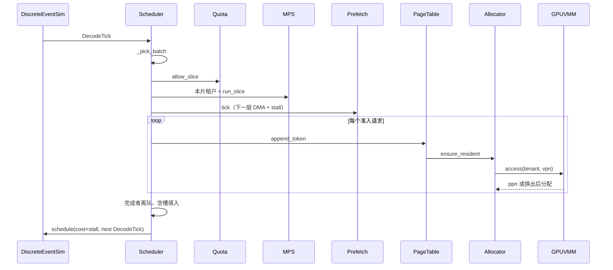

# 系统设计文档

**项目：** llmOS（面向大模型推理优化的操作系统级任务）  
**实现方式：** 个人独立完成；仿真为主交付。真实模型 / Colab 对照延期，见 `GPU对照技术方案.md`。

## 1 OS 映射

| OS 子系统 | 模块 | 请求路径中的位置 |
| --- | --- | --- |
| 进程调度 | `ContinuousBatchingScheduler` / `StaticBatchingScheduler` | `_decode_tick` 内选本片 batch |
| 资源管理 | `QuotaManager` + `MPSScheduler` | 显存硬上限、本片可运行租户 |
| I/O | `PrefetchRuntime` | `tick(sim)` 发 DMA，stall 计入本片 cost |
| 虚拟内存 | `GPUVMM` | GPA→HPA，超卖与越界拦截 |
| 分页 | `PageTable` + `BlockAllocator` | `append_token` → `ensure_resident` → `VMM.access` |

## 2 全路径时序（一次 decode）

预取不占用真实线程：完成时刻入事件堆，`kind=DmaComplete`。stall 只计「计算等到数据就绪」。

## 3 实现要点

- 时钟：`heapq`，同分用 `seq` 打破平局，内核无 `sleep`。
- 随机：仅 `random.Random(seed)` 生成负载。
- 配置：一律 `configs/default.yaml`，结果带 `config_digest`。
- 冻结接口：分配器 / 页表 / VMM / 调度器保持原方法名；扩展以可选参数追加（如 `vmm=`、`prefetch=`）。
- 明确不做：MLFQ、伙伴系统、ARC、vLLM、云端 GPU。

## 4 模块职责与禁止越权

调度器只编排，不实现别人的策略。

| 模块 | 允许 | 禁止（未越权） |
| --- | --- | --- |
| `DiscreteEventSim` | `now` + 事件堆 | 无选批、无分配 |
| `Scheduler` | 入队、选批、抢占、PCB 统计 | 不 import `GPUVMM` / `BandwidthModel` |
| `QuotaManager` | 份额、硬上限、`allow_slice` | 不决定谁先 decode |
| `PrefetchRuntime` | 重叠与 stall | 不改页表 |
| `GPUVMM` | 驻留、换出、balloon、越界 | 不懂 token |
| `PageTable` / `Allocator` | 映射、COW、碎片、向 VMM 要页 | 不实现时间片（在 MPS） |

`BlockAllocator.tenant` 在每个请求 `step` 前切换，供 VMM 按租户拦截。`experiments.py` 是评测总装，E7/E9/E10 可直接打预取/VMM/MPS。
